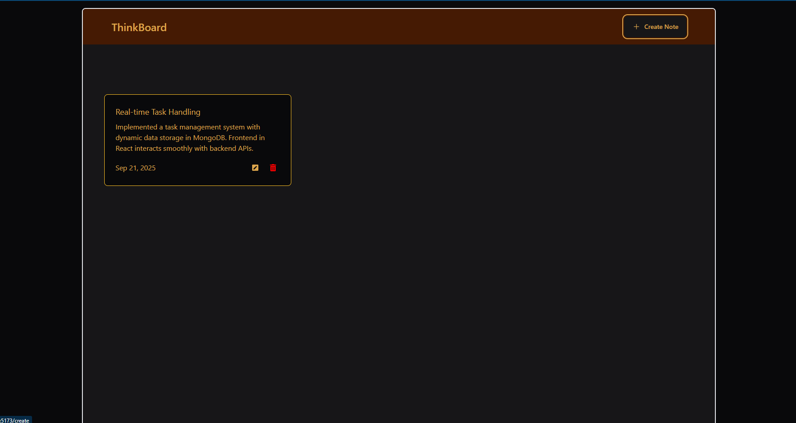
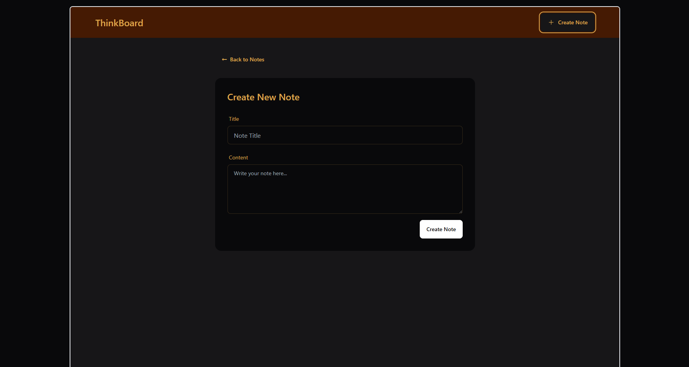
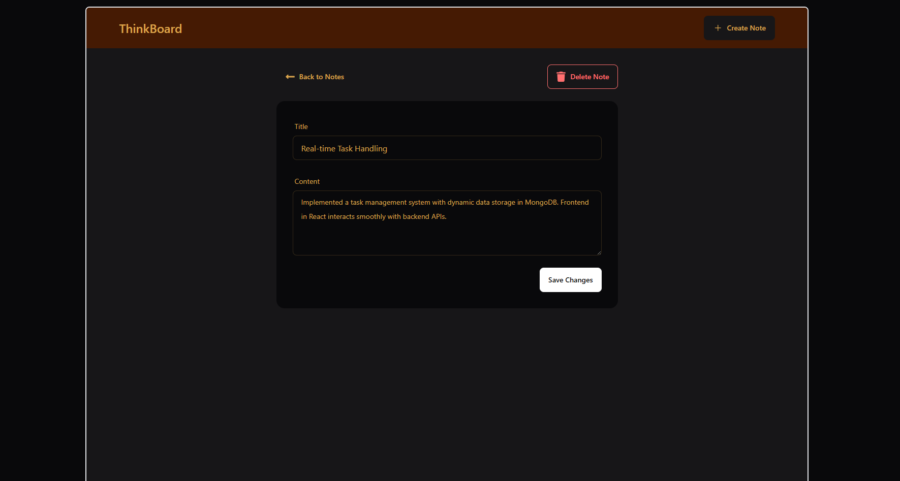

# 📌 My First MERN Task Manager

A simple **Task Manager** project built with the **MERN stack** for practice.  
It follows the **MVC architecture** and allows users to **create, edit, and delete notes**.  

---

## 🚀 Features
- ✏️ Create new notes  
- 🗑️ Delete existing notes  
- 🛠️ Edit notes  
- 🗂️ Organized using **MVC pattern**  

---

## 🛠️ Tech Stack
- **Frontend:** React.js  
- **Backend:** Node.js + Express.js  
- **Database:** MongoDB  
- **Architecture:** MVC  

---

## 📸 Screenshots 
<table>
  <tr>
    <td></td>
    <td></td>
  </tr>
  <tr>
    <td style="text-align:center;"></td>
  </tr>
</table>

---

## 💻 Setup & Instructions  

1. **Clone the repository**  
   ```bash
   git clone https://github.com/Erfan-Khan-Dhrubo/my-first-mern-task-manager.git
   cd my-first-mern-task-manager
   ```

2. **Backend setup**  
   Open a terminal and run:  
   ```bash
   cd backend
   npm install
   npm run dev
   ```

3. **Frontend setup**  
   Open another terminal and run:  
   ```bash
   cd frontend
   npm install
   npm run dev
   ```
